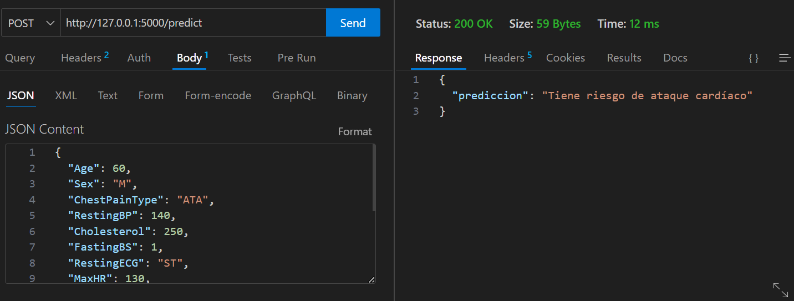
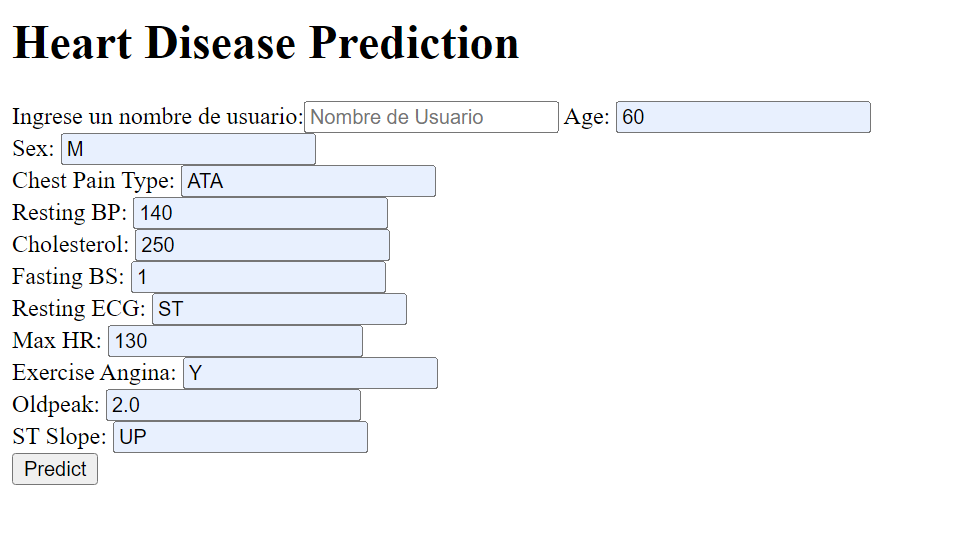
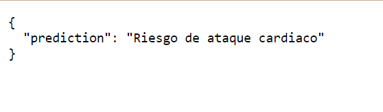
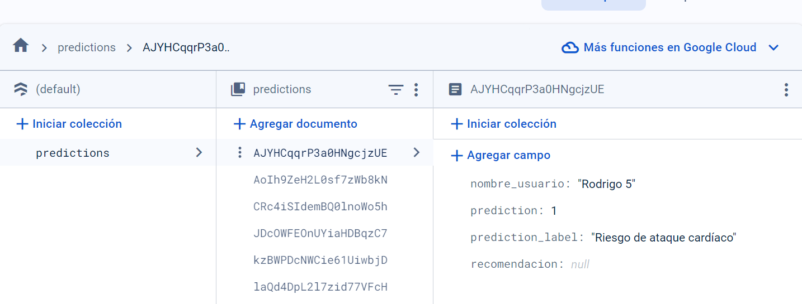
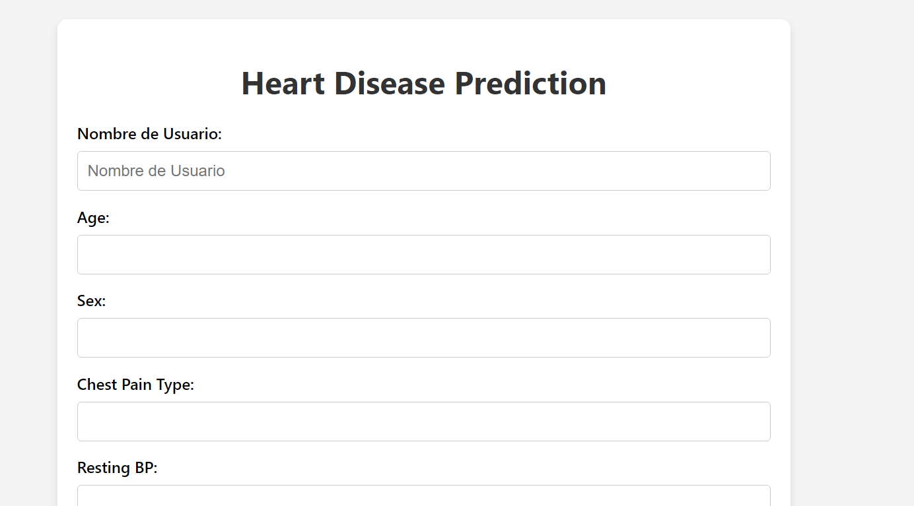
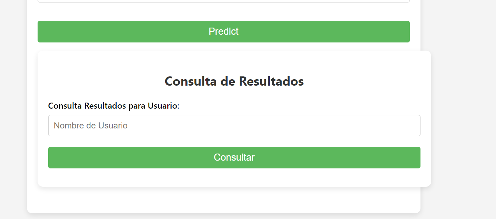
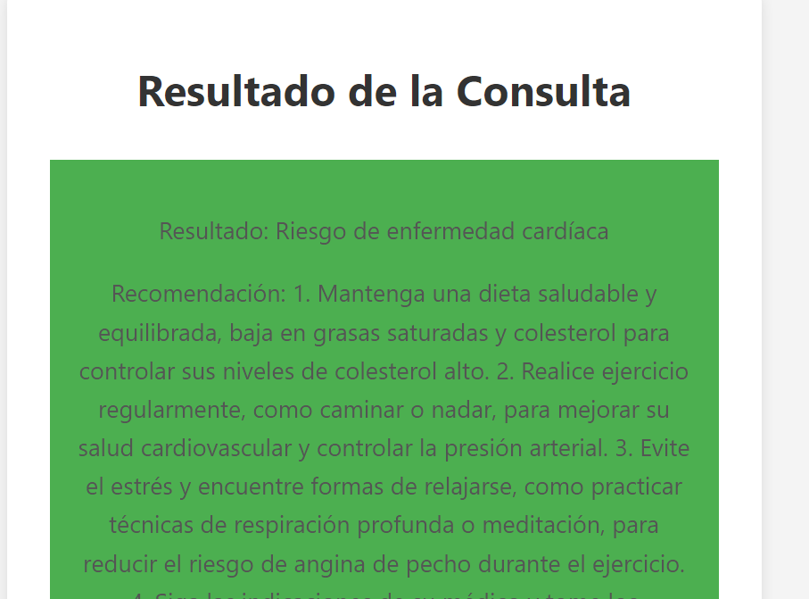

# Nombre del Proyecto
Creacion de Api utilizando CATBOOST with OPTUNA
## Introducción
La premisa inicial del reto planteado era utilizar el algoritmo de clasificación CATBOOST para predecir, utilizando datos de nuevos usuarios, si la persona podría sufrir de alguna enfermedad cardíaca.
El modelo se entrenó en base a un dataset llamado heart.csv que contenía diversa información acerca de características de personas que presentaban o no alguna enfermedad cardíaca. Al ser el algoritmo CATBOOST el de mayor precisión, se utilizó este mismo para la elaboración de la API.

## Tecnologías Utilizadas
- Flask
- Firebase
- OpenAI API
- Circuit breaker
- Sklearn
- html/css
- Pandas/nunpy

## Desarrollo de la api
Como punto de partida, basé la creación de mi API en el funcionamiento de una clínica de análisis, ya que estas te brindan todos los resultados biológicos que posees para posteriormente ser diagnosticado por un doctor. En este caso, mi API procesaba los datos y el algoritmo te predecía si tenías riesgo cardíaco. Esta premisa nos acompañará durante toda la realización de la API.

### Subsección 1: Lectura de el algoritmo CATBOOST
En la página donde se explica cómo funciona el algoritmo, nos brindan la explicación del modelo, el código y la forma de entrenamiento de CATBOOST, esto se replica y coloca en el archivo de Jupyter modelo_riesgo_cardiaco, el cual lo utilizaremos para nuestra posterior API. En el contenido del archivo, podemos ver la data que usaremos, el modelo de predicción otorgado, y algunas pruebas con data para corroborar su correcto funcionamiento.

### Subsección 2: Creacion inicial de la api 
Para poder avanzar y seguir con la creación de la API, utilicé la librería joblib, la cual nos permite cargar datos de un archivo Jupyter e implementarlo en un archivo .py, lo cual era clave para poder continuar con el desarrollo de la API.

Para la primera parte de la API, desarrollamos un endpoint inicial que recibía los datos en formato JSON; estos datos eran convertidos en un DataFrame para su análisis mediante nuestro modelo previamente entrenado, determinando si el individuo poseía alguna enfermedad cardíaca.

Este proceso se validó utilizando la aplicación Visual Studio Code con la extensión Thunder Client, que facilita la realización de solicitudes de manera sencilla, como se muestra en la imagen siguiente.

Con este resultado ya teniamos resuelto la problematica iniciar, ya que recibiamos un jason de data y el modelo entrenado te predecia sus problemas cardiacos, sin embargo un modelo asi no era muy intituivo, y sin la aplicacion utilizada de visual code seria muy engorroso llevar esa data a ser predecida, por lo cual agregamos una estrategia mas

### Subsección 3: Valor Agregado Interfaz de usuario intuitiva
Al tener una problemática planteada anteriormente, decidí llevar la data a un front sencillo, el cual sería de la forma de un formulario, donde sería más intuitivo para la persona el ingreso de la data y su posterior predicción.

y posteriormente el resultado tmb se muestra:

 
### Subsección 3: Valor Agregado  almacenamiento de datos 

Como tenía pensado resolver esta problemática como una especie de clínica donde los pacientes podrían dejar sus resultados y que el algoritmo de clasificación sería el que interprete estos mismos, necesitaba guardar la data para que las personas puedan ver sus resultados posteriormente, si bien apenas recibe la data el modelo te libera la prediccion, este tambien guarda esa data para que funcione como una especie de historial medico en el cual ver la evolucion de sus resultados.Asimismo se mejoro el front, para verse de una mejor manera.
A continuacion mostramos como se guarda la data en firebase:

Como podemos observar, se guarda el nombre del usuario, la predicción en este caso si es 1 o 0, y también si tiene riesgo de problema cardíaco; la recomendación es un extra que veremos en el siguiente punto

Tambien observaremos la mejoria del front, y la nueva casilla en la cual si ya tenemos resultados en la base de datos podemos verlos cuando querramos.

### Subsección 3: Valor Agregado  Integracion con Open AI 
Para el último valor agregado, decidí utilizar el API key de OpenAI, que proporciona una recomendación personalizada dependiendo de si el resultado indica que podrías tener problemas de corazón. Esta recomendación se almacena en la base de datos y está disponible para el usuario solo cuando consulta sus resultados, funcionando como una especie de consejo médico virtual.

En resumen,se integró una clave de API de OpenAI para ofrecer recomendaciones personalizadas que se almacenan en la base de datos, funcionando como un consejo médico virtual.

## Uso
-Primero, es necesario ejecutar el Jupyter Notebook llamado prediction_explanation_and_test, ya que este carga el modelo de riesgo cardíaco, el cual es fundamental para el correcto funcionamiento de la API.
-Después, se debe iniciar el servidor Flask desde la carpeta Rodrigo_Carlos_Acosta, asegurándose de que no haya problemas con las credenciales de Firebase en credenciales.json.

-Por último, ponga la data analizar y, a continuación, retroceda a la página anterior para buscar su información, lo cual debería funcionar de manera correcta.

## Conclusiones
-La construcción de esta API ha sido un ejercicio integral de desarrollo de software y ciencia de datos.Esto ocurre cuando se juntan ambos mundos
-Se considera que no sea recomdable seguir el consejo de una ia que aprende, sin embargo creo que el data set tiene mucha correlacion entre sus variables, premitiendo una correcta interpretacion y confiabilidad de los resultados.

## Autor
- Rodrigo Carlos Acosta

