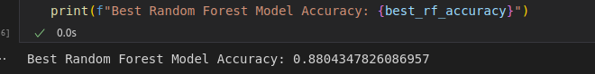

# Heart Failure Prediction Project

## Overview

This project focuses on predicting Heart Failure using advanced machine learning models and the develop of an API in Google Cloud Platform. The predictive model attains an impressive accuracy score of 0.88, showcasing its efficacy in healthcare analytics.

## API Development

To enhance accessibility and real-world usability, an intuitive API has been meticulously developed using FastAPI. This API is designed to seamlessly integrate with external applications or services, providing a convenient interface for Heart Failure predictions.

## Deployment on Google Cloud Platform

The entire system is deployed on the robust infrastructure of Google Cloud Platform (GCP). This cloud-based deployment ensures scalability, reliability, and efficient management of computational resources. Leveraging GCP's services, the API is hosted in a manner that guarantees optimal performance and availability.

## Development of the ML model

My approach for this project was the correct preprocessing of the data. In order to do this, I've analyzed all categorical and numerical variables from our dataset. After that, I plotted different statistical graphics for the guarantee that our data is correctly clean. So, I used Pycaret to compare and get the best model for our problem. In this case, the two best models was Gradient Boosting and Random Forest Classification. After implementing those models using sklearn, we have selected Random Forest Classification because it shows a better performance in all metrics. After fine-tuning we've got an accuracy of 0.88.
Relevant images and statistical data are showed below:



In [notebooks](notebooks) directory, you will see 3 notebooks. [modelo.ipynb](notebooks/modelo.ipynb) represents the model based on Pycaret, and [gbc.ipynb](notebooks/gbc.ipynb) and [rf.ipynb](notebooks/rf.ipynb) represents the Gradient Boosting and Random Forest Classification. You can choose any of the 3 nootebooks to run and test in [app.py](app.py).
## Running the Project

There are two options for running the project: locally and on GCP(Google Cloud Platform).

### Local Setup

1. Create a virtual environment and install dependencies from `requirements.txt`:

   ```bash
   python -m venv venv
   source venv/bin/activate      # On Windows, use "venv\Scripts\activate"
   pip install -r requirements.txt

2. Run the notebook to train the model:
   ```bash
   jupyter notebook modelo.ipynb

3. Launch the FastAPI script using Uvicorn:
   ```bash
   uvicorn app:app --host 0.0.0.0 --port 8000 --reload
4. Testing

   You can test the API using tools like Swagger API from FastAPI, Postman or cURL. Here's an example using cURL:

   ```bash
   curl -X POST "http://127.0.0.1:8000/predict" -H "Content-Type: application/json" -d '{
   "Age": 49,
   "Sex": "F",
   "ChestPainType": "NAP",
   "RestingBP": 160,
   "Cholesterol": 180,
   "FastingBS": 0,
   "RestingECG": "Normal",
   "MaxHR": 156,
   "ExerciseAngina": "N",
   "Oldpeak": 1,
   "ST_Slope": "Flat"
   }'
Also, here is an example using our Swagger:


### Test Google Cloud Run Service

You can test the deployed Google Cloud Run service using cURL or Postman. This API was deployed on this link `https://default-service-xavw6nwqvq-tl.a.run.app/predict`.

```bash
curl -X POST -H "Content-Type: application/json" -d '{
  "Age": 40,
  "Sex": "M",
  "ChestPainType": "ATA",
  "RestingBP": 140,
  "Cholesterol": 289,
  "FastingBS": 0,
  "RestingECG": "Normal",
  "MaxHR": 172,
  "ExerciseAngina": "N",
  "Oldpeak": 0,
  "ST_Slope": "Up",
  "HeartDisease": 0
}' https://default-service-xavw6nwqvq-tl.a.run.app/predict
 ```
Also, the docker container of this API has been deployed in GCP as we can see below:

### Test using Pytest

You can test the API with the script [testing.py](testing.py). In this script, we guaranteed that our API works correctly and returns the correct result.
So, you need to run

  ```bash
  pytest testing.py

 ```

