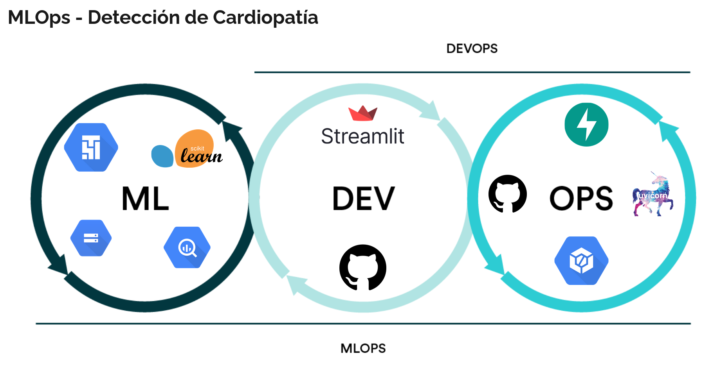

# Heart Disease Detection System
This project aims to detect heart disease using Machine Learning. It uses GPC, Github, python and python libraries to build and mantain Machine Learning. 

The project consists of 4 directories:
- setup: python and bash files to build entities in GCP and upload data into Bigquery and Cloud Storage
- backend: to build and deploy the API in Cloud Run and Cloud Build.
- frontend: to build and deploy the interface in Streamlit Cloud.
- training: to traing and save models continuously using Composer.
- fuentes: CSV file datasets
